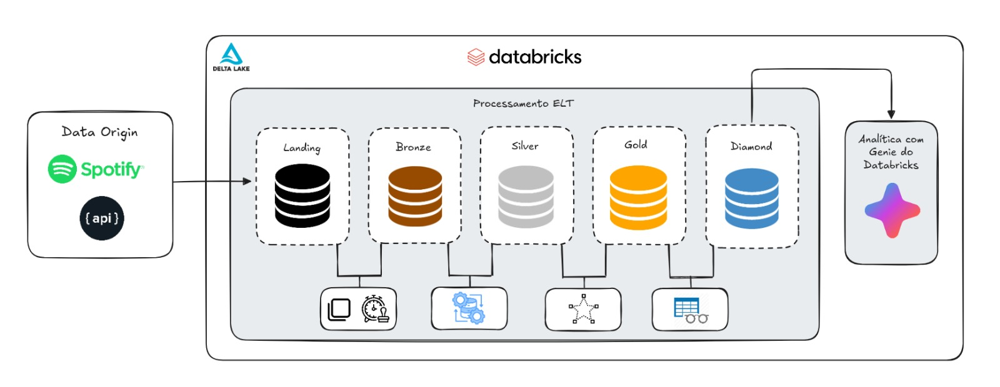

# Spotify Analytics - Databricks Pipeline

Pipeline ELT com arquitetura Lakehouse (Bronze/Silver/Gold/Diamond) para análise de dados do Spotify usando Delta Lake e PySpark.

## Arquitetura



---

## Quick Start

### 1. Extração de Dados

```bash
src/landing/src_spotify_api_extraction.ipynb
```

### 2. Inicialização (Executar UMA VEZ)

```bash
init_setup.ipynb
```

### 3. Criar Tabelas (DDL)

```bash
# Bronze
ddl/bronze/ddl_tb_bronze_search.ipynb

# Silver
ddl/silver/ddl_tb_tracks.ipynb
ddl/silver/ddl_tb_tracks_invalidos.ipynb
ddl/silver/ddl_tb_track_artists.ipynb
ddl/silver/ddl_tb_track_artists_invalidos.ipynb

# Gold
ddl/gold/ddl_dm_artist.ipynb
ddl/gold/ddl_dm_track.ipynb
ddl/gold/ddl_dm_tempo.ipynb
ddl/gold/ddl_ft_track_popularity.ipynb
```

### 4. Processar Dados (SRC)

```bash
# Bronze
src/bronze/src_bronze_ingestion.ipynb

# Silver
src/silver/src_tb_tracks.ipynb
src/silver/src_tb_track_artists.ipynb

# Gold
src/gold/src_dm_artist.ipynb
src/gold/src_dm_track.ipynb
src/gold/src_dm_tempo.ipynb
src/gold/src_ft_track_popularity.ipynb

# Diamond
src/diamond/src_vw_ft_track_popularity.ipynb
src/diamond/src_vw_dm_artist.ipynb
src/diamond/src_vw_dm_track.ipynb
src/diamond/src_vw_dm_tempo.ipynb
```

---

## Estrutura do Projeto

```
databricks_pipeline/
├── init_setup.ipynb          # Configuração inicial (catálogo + schemas)
│
├── ddl/                      # Data Definition Language
│   ├── bronze/               # Tabelas raw
│   ├── silver/               # Tabelas limpas + auditoria
│   └── gold/                 # Star Schema (dimensões + fato)
│
├── src/                      # Source/Processamento
│   ├── landing/              # Extração API Spotify
│   ├── bronze/               # Ingestão raw
│   ├── silver/               # Limpeza e normalização
│   ├── gold/                 # Modelagem dimensional
│   └── diamond/              # Views de BI
│
│
└── README.md                 # Este arquivo
```

---

## Camadas do Lakehouse

### 🥉 Bronze (Raw)

- **Tabela**: `spotify_analytics.bronze.tb_bronze_search`
- **Formato**: JSON bruto da API
- **Características**: Imutável, schema-on-read, particionado por data

### 🥈 Silver (Cleaned)

- **Tabelas**:
  - `spotify_analytics.silver.tb_tracks` (músicas)
  - `spotify_analytics.silver.tb_track_artists` (relacionamento)
  - `spotify_analytics.silver.tb_tracks_invalidos` (auditoria)
  - `spotify_analytics.silver.tb_track_artists_invalidos` (auditoria)
- **Características**: Dados limpos, validados, deduplicados, MERGE incremental

### 🥇 Gold (Analytics - Star Schema)

- **Dimensões**:
  - `spotify_analytics.gold.dm_artist` (artistas)
  - `spotify_analytics.gold.dm_track` (músicas)
  - `spotify_analytics.gold.dm_tempo` (temporal)
- **Fato**:
  - `spotify_analytics.gold.ft_track_popularity` (métricas + flags)
- **Características**: Surrogate keys, flags de negócio, MD5 hash, MERGE incremental

### 💎 Diamond (BI Views)

- **Views**:
  - `spotify_analytics.diamond.vw_ft_track_popularity`
  - `spotify_analytics.diamond.vw_dm_artist`
  - `spotify_analytics.diamond.vw_dm_track`
  - `spotify_analytics.diamond.vw_dm_tempo`
- **Características**: SELECT \* FROM das tabelas Gold, JOINs feitos no BI

---

## Pré-requisitos

- Databricks Workspace (Community ou Standard)
- Databricks Runtime 13.3+ com Delta Lake
- Secrets configurados:
  - `spotify_client_id` (scope: spotify)
  - `spotify_client_secret` (scope: spotify)
- Permissões para criar catálogos e schemas

---

## Stack Tecnológico

| Componente    | Tecnologia                   |
| ------------- | ---------------------------- |
| Plataforma    | Databricks                   |
| Processamento | PySpark 3.4+                 |
| Storage       | Delta Lake 2.4+              |
| Catálogo      | Unity Catalog                |
| API           | Spotify Web API v1           |
| Autenticação  | OAuth 2.0 Client Credentials |

---

## Features Principais

✅ **ELT Architecture** - Extract, Load, Transform usando Lakehouse
✅ **Star Schema (Kimball)** - Modelagem dimensional profissional
✅ **Delta Lake** - ACID transactions, MERGE, time travel
✅ **Surrogate Keys** - cd_artist, cd_track, cd_tempo
✅ **Business Flags** - fl_mega_hit, fl_alta_popularidade, fl_explicit
✅ **Data Quality** - Validação, tabelas de auditoria, integridade referencial
✅ **OAuth 2.0** - Client Credentials Flow com retry e rate limiting
✅ **Incremental Load** - MERGE para UPSERT em todas camadas
✅ **BI Ready** - Views otimizadas para Power BI/Tableau

---

## Exemplo de Query

```sql
-- Top 10 artistas com mais mega-hits
SELECT
    a.nm_artist,
    SUM(f.fl_mega_hit) as qtd_mega_hits,
    AVG(f.val_popularity) as popularidade_media
FROM spotify_analytics.diamond.vw_ft_track_popularity f
JOIN spotify_analytics.diamond.vw_dm_artist a ON f.cd_artist = a.cd_artist
WHERE f.fl_mega_hit = 1
GROUP BY a.nm_artist
ORDER BY qtd_mega_hits DESC
LIMIT 10;
```

---

## Convenções de Nomenclatura

### Notebooks

- DDL: `ddl_<prefixo>_<nome>.ipynb`
- SRC: `src_<prefixo>_<nome>.ipynb`

### Tabelas/Views

- Bronze/Silver: `tb_<nome>`
- Dimensões: `dm_<nome>`
- Fatos: `ft_<nome>`
- Views: `vw_<nome>`

### Colunas

- `id_` - Identificador natural
- `cd_` - Código/Surrogate key
- `pk_` - Primary key
- `nm_` - Nome
- `ds_` - Descrição
- `dt_` - Data
- `nu_` - Número
- `val_` - Valor/métrica
- `fl_` - Flag booleana
